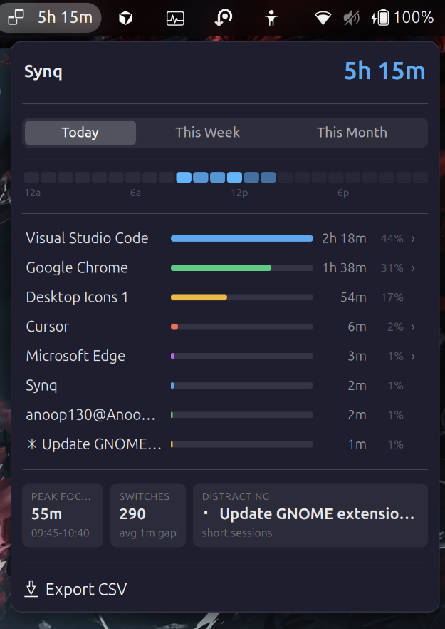
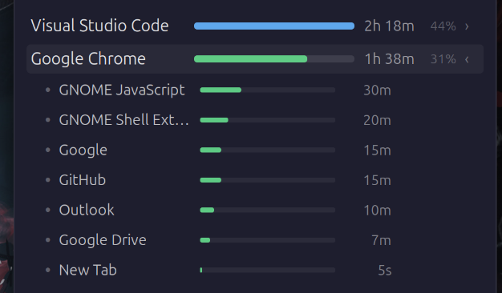
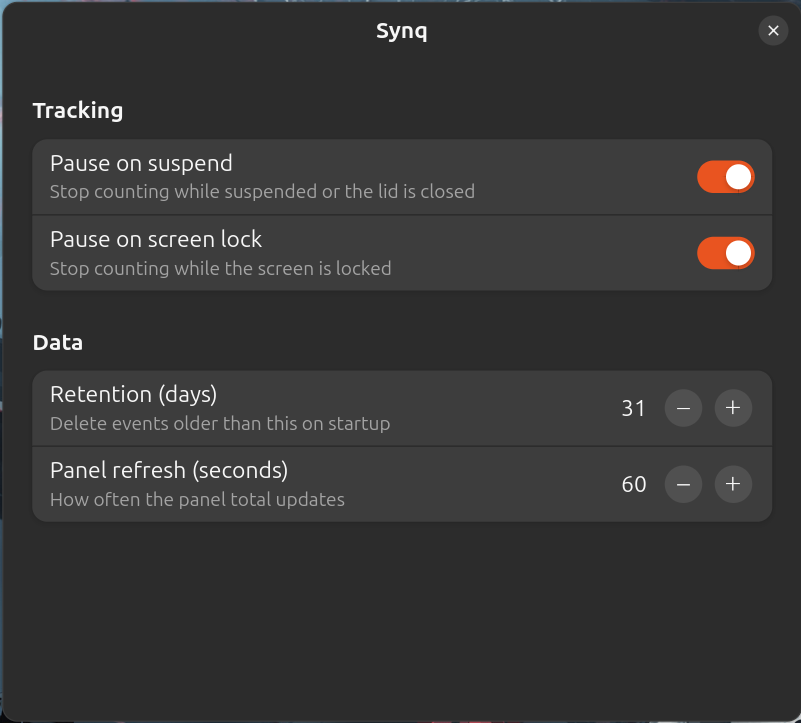

# Synq

A GNOME Shell extension that tracks active application and window usage, shows
summaries in the top panel, and exposes a DBus API for external collectors.


## Features

- **Panel total**: Live today total in the top bar
- **Time ranges**: Today, This Week, and This Month views
- **Activity heatmap**: 24 hour timeline for the selected range
- **App breakdown**: Per application bars with percentages
- **Nested activities**: Expand apps to see tabs, sites, or projects
- **Insight cards**: Peak focus block, context switches, distracting app
- **Smart pauses**: Optional pause on suspend, lid close, and screen lock
- **CSV export**: Download events for the selected range
- **DBus API**: Signals and methods for the Synq collector and other tools
- **Preferences**: Standard GNOME extension settings dialog

## Screenshots

### Panel View



Expand an application row to see nested tab or project time.



### Preferences



## Installation

### From Source (Manual Installation)

1. Clone this repository:

   ```bash
   git clone https://github.com/Anoop130/synq-gnome.git
   cd synq-gnome
   ```

2. Compile the settings schema:

   ```bash
   glib-compile-schemas synq-gnome@rsim/schemas/
   ```

3. Copy the extension to the GNOME extensions directory:

   ```bash
   cp -r synq-gnome@rsim ~/.local/share/gnome-shell/extensions/
   ```

4. Enable the extension:

   ```bash
   gnome-extensions enable synq-gnome@rsim
   ```

5. Restart GNOME Shell:
   - **X11**: Press `Alt+F2`, type `r`, and press Enter
   - **Wayland**: Log out and log back in

### From ZIP File

1. Download the latest `synq-gnome@rsim.shell-extension.zip` from [Releases](https://github.com/Anoop130/synq-gnome/releases)
2. Install and enable:

   ```bash
   gnome-extensions install synq-gnome@rsim.shell-extension.zip
   gnome-extensions enable synq-gnome@rsim
   ```

## Configuration

1. Open extension settings:
   - Right-click the Synq icon in the top bar, then open preferences if available
   - Or run: `gnome-extensions prefs synq-gnome@rsim`

2. Adjust tracking behavior (optional):

   | Setting | Default | Effect |
   |---|---|---|
   | Pause on suspend | on | Stop counting while suspended or the lid is closed |
   | Pause on screen lock | on | Stop counting while the screen is locked |
   | Retention (days) | 31 | Delete events older than this on startup |
   | Panel refresh (seconds) | 60 | How often the panel total is recomputed |

Events are stored at `~/.local/share/synq-gnome/events.jsonl`.

## Usage

Once enabled, Synq will:

- Show total active time for today in the top panel (for example, `5h 15m`)
- Open a detailed popup from the panel icon with:
  - **Time range tabs**: Today, This Week, or This Month
  - **Hourly heatmap**: When activity happened across the day
  - **Application list**: Time and share per app, with expandable nested rows
  - **Insight cards**: Longest focus block, switch count, most distracting app
  - **Export CSV**: Save the current range to a file
- Emit DBus events when the focused window changes for external tools
- Pause tracking during suspend, lid close, or lock when those options are enabled

### Demo data

To preview the UI without waiting for real usage:

```bash
python3 scripts/generate-demo-events.py
gnome-extensions disable synq-gnome@rsim
gnome-extensions enable synq-gnome@rsim
```

## Requirements

- GNOME Shell 45, 46, or 47
- X11 or Wayland session with a focusable window title (typical desktop use)

## Integration (DBus)

Bus name: `io.github.Synq.GnomeExtension`  
Object path: `/io/github/Synq/GnomeExtension`

| Kind | Name | Description |
|---|---|---|
| signal | `WindowChanged(s title, s timestamp)` | Fired when the active window changes |
| method | `GetCurrentWindow() -> s` | Returns the current window title |
| method | `GetEvents(x since_unix) -> s` | JSON array of `{title, ts}` since a Unix time |

When tracking pauses, the title `__IDLE__` is emitted so subscribers can exclude away time. The [Synq](https://github.com/Anoop130/synq) server collector ignores these before forwarding samples.

## Development

### Setting Up a Development Environment

```bash
git clone https://github.com/Anoop130/synq-gnome.git
cd synq-gnome

ln -s $(pwd)/synq-gnome@rsim \
  ~/.local/share/gnome-shell/extensions/synq-gnome@rsim

glib-compile-schemas synq-gnome@rsim/schemas/
gnome-extensions enable synq-gnome@rsim
```

### Making Changes

After editing code:

```bash
gnome-extensions disable synq-gnome@rsim

# Recompile schemas only if schemas/*.xml changed
glib-compile-schemas ~/.local/share/gnome-shell/extensions/synq-gnome@rsim/schemas/

gnome-extensions enable synq-gnome@rsim
```

Restart GNOME Shell (X11: `Alt+F2` then `r`; Wayland: log out and back in).

### Viewing Logs

```bash
journalctl -f -o cat /usr/bin/gnome-shell | grep -i synq
```

## Troubleshooting

### Extension not showing

- Confirm the extension is enabled: `gnome-extensions enable synq-gnome@rsim`
- Check logs: `journalctl -f -o cat /usr/bin/gnome-shell | grep -i synq`

### Panel shows no time

- Use the desktop for a few minutes so window events are recorded
- Or load demo data (see **Demo data** under Usage)

### Settings not saving

- Recompile schemas:

  ```bash
  glib-compile-schemas ~/.local/share/gnome-shell/extensions/synq-gnome@rsim/schemas/
  ```

- Disable and re-enable the extension, then restart GNOME Shell

## Contributing

Contributions are welcome. Please open a pull request on GitHub.

## License

This project is licensed under the MIT License. See [LICENSE](LICENSE).

## Credits

- Panel UI patterns adapted from [WakaPanel](https://github.com/Anoop130/wakapanel)
- Part of the [Synq](https://github.com/Anoop130/synq) activity tracking system (also used as a git submodule there)

## Support

If this extension is useful:

- Star the repository
- Report issues on GitHub
- Send pull requests for fixes and improvements

---

**Note**: The main Synq repository vendors this project as a submodule. Install and report issues from [synq-gnome](https://github.com/Anoop130/synq-gnome) for extension-only changes.
